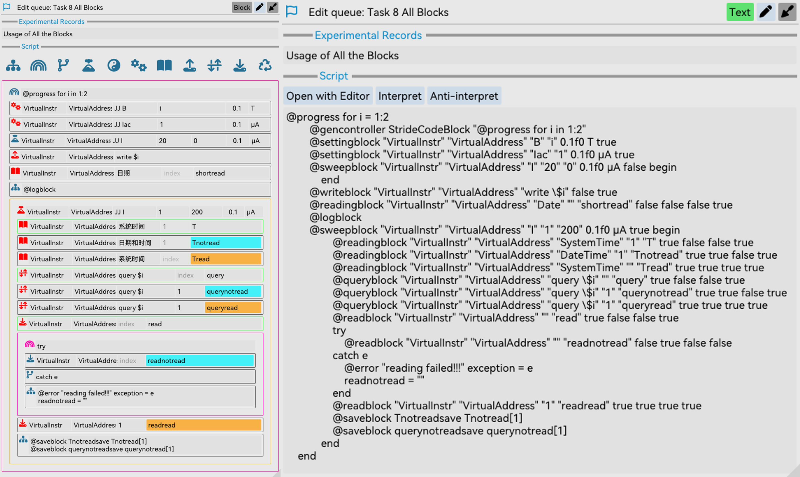
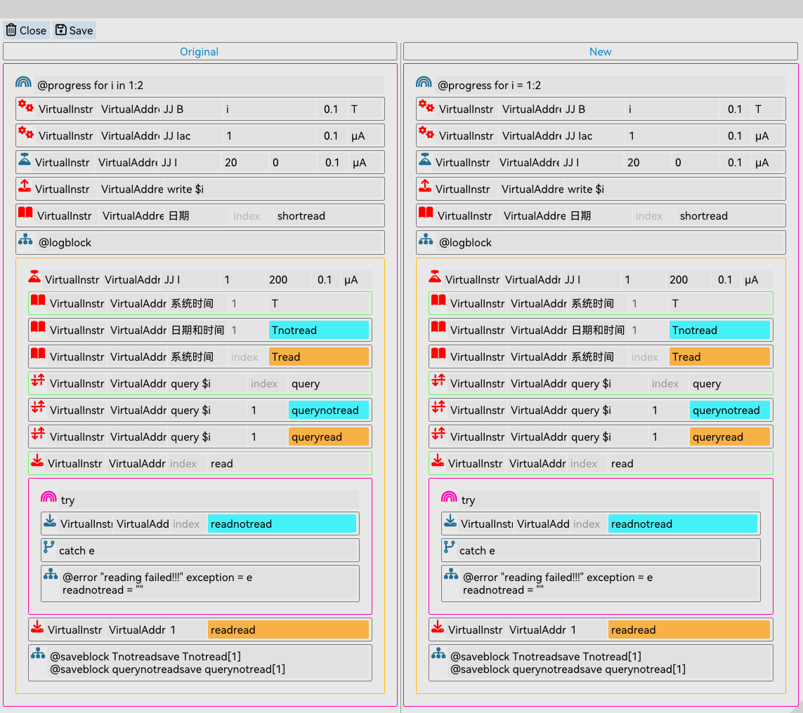

# QInsControl

<!-- [](https://FaresX.github.io/QInsControl.jl/stable/) -->
[](https://FaresX.github.io/QInsControl.jl/dev/)
[](https://github.com/FaresX/QInsControl.jl/actions/workflows/CI.yml?query=branch%3Amaster)
[](https://codecov.io/gh/FaresX/QInsControl.jl)

QInsControl is designed for controling instruments and data acquiring, which is based on the NI VISA and provides a 
friendly GUI and a flexible script written mannar to keep both the convenience and universality. 
See [docs](https://FaresX.github.io/QInsControl.jl/dev/) here or 视频【QInsControl.jl 开源的可编程仪器控制和数据采集工具】 https://www.bilibili.com/video/BV1Y2421N75d/?share_source=copy_web&vd_source=9bb5f2e2197b605d0d141ae8f55c67c7

## install
Before installation, make sure you have NI VISA installed! **Now it's able to run without VISA and supports TCPIP socket and serial port. At the same time, instruments tracked by the ISOBUS are allowed to be splited into individual addresses.**
```
julia> ]
(@v1.10) pkg> add https://github.com/FaresX/QInsControl.jl.git
```
or you can download the execution file on the releases pages, which is a quicker taste.

## usage
```julia
using QInsControl
QInsControl.start()
```
TCPIP address: TCPSOCKET::127.0.0.1::8080 [TCPSOCKET::**ip**::**port**]  
serial port address: SERIAL::COM1 [SERIAL::**port**]  
ISOBUS address: ASRL1::INSTR::ISOBUS::1 or SERIAL::COM1::ISOBUS::1 [original address::ISOBUS::**port**]

## example

A simple project file [demo.daq](example) is in the example folder, which gives some ideas to write your own scripts.
## scripts
Block mode and text mode can be changed from each other. Block mode is better for selecting instruments, addresses and quantities and some more useful functions. Text mode is better for reading and copying codes. Only block mode is supported to be compiled to executable tasks and run them.


## custom widgets
now it comes to a new feture that anyone could create your own widgets to control the instruments.


<!-- ## <font color=#FF0000>**Note**</font>
At present, the GUI may get crashed thanks to some bugs that do not interrupt the running DAQ program. When encountered, 
one could run
```julia
QInsControl.UI(true)
```
to restart the GUI and give feedback on github Issues. -->

## Contributing
See [here](https://github.com/FaresX/QInsControlAssets) to contribute to this package.
