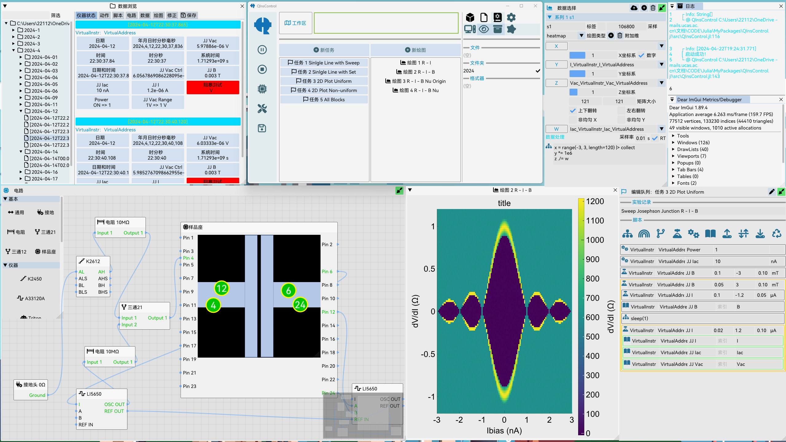

# QInsControl

<!-- [](https://FaresX.github.io/QInsControl.jl/stable/) -->
[](https://FaresX.github.io/QInsControl.jl/dev/)
[](https://github.com/FaresX/QInsControl.jl/actions/workflows/CI.yml?query=branch%3Amaster)
[](https://codecov.io/gh/FaresX/QInsControl.jl)

QInsControl is designed for controling instruments and data acquiring, which is based on the NI VISA and provides a 
friendly GUI and a flexible script written mannar to keep both the convenience and universality.

## install
Before installation, make sure you have NI VISA installed!
```
julia> ]
(@v1.9) pkg> add ImPlot#main
(@v1.9) pkg> add https://github.com/FaresX/QInsControl.jl.git
```

## usage
```julia
using QInsControl
QInsControl.start()
```

## example

A simple project file [demo.daq](example) is in the example folder, which gives some ideas to write your own scripts.

## <font color=#FF0000>**Note**</font>
At present, the GUI may get crashed thanks to some bugs that do not interrupt the running DAQ program. When encountered, 
one could run
```julia
QInsControl.UI(true)
```
to restart the GUI and give feedback on github Issues.

## Contributing
See [here](https://github.com/FaresX/QInsControlAssets) to contribute to this package.