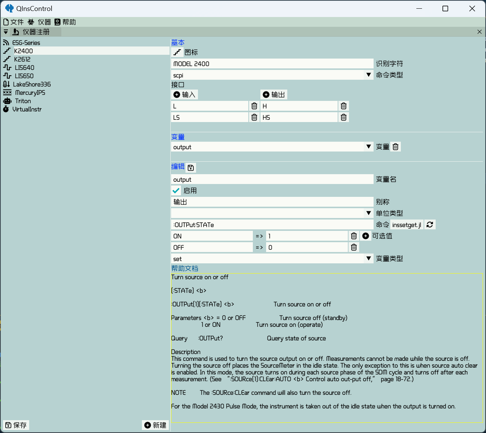

# Instrument register
Instrument register provides a convenient mannar to add new instruments and define new quantities to extend the
functionality.


## Add a new instrument
It is very easy to add a new instrument by clicking on the button "新建". A well-defined instrument includes an icon, 
an identification string, command type, input and output interface corresponding to the physical ones and several
user-defined quantities. These attributes can be devided into two parts basic one and quantities which are described as
follows.

### Basic Configuration

icon : click on the button labeled an icon to change to a new one.

识别字符 : identification string has to be unique for the editing instrument, which can be obtained by querying the
instrument the command "*IDN?" and pick up the unique parts.

命令类型 : command type as a hint for auto-generate set and get function can be made sure by looking up the instrument
manual. At present, it surpports tsp (2600 series and so on) and scpi (mostly used). For the other command types, select
the blank option.

接口 : to add some input and output ports

### Quantity

变量名 : variable name used internally which is better to consist only of English letters.

启用 : a checkbox to decide whether the quantity is to be used

别称 : name for convenient identification which is visible to user

单位类型 : unit type of the obtained data via the specified quantity. When the data are text type, select the blank option.

命令 : the command header for the specified quantity. For scpi, it has to be in the form **Header Value** for a sweepable or settable quantity or the form **Header?** for an only readable quantity. The button inssetget.jl on the right is used to open the file inssetget.jl to manually add functions of set and get which is necessary when command or command type is not in the standard form. When manually add the set and get functions, one have to ebey the following forms
```julia
function [Instrument Name]_[Quantity Name]_set(instr, val)
end
function [Instrument Name]_[Quantity Name]_get(instr)
    return readvalue
end
```
where instr parameter is necessary and generally used with fundamental functions write, query and read same as in NI VISA. Click on the rightmost button to hot reload all the functions.

可选值 : This is only suitable for a settable quantity whose settable values are descrete. One can give a key on the left for convenience and corresponds to an available option value.

变量类型 : It has three options sweep, set and read. Different type has different behavior.