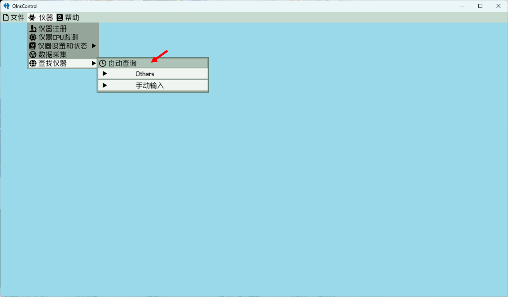
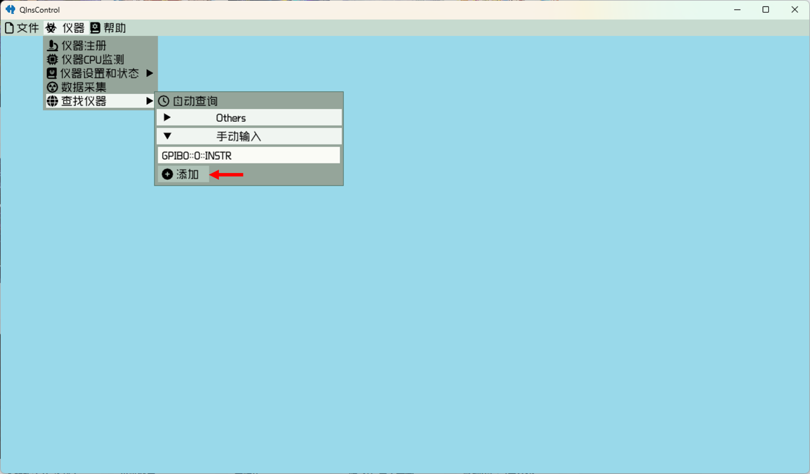
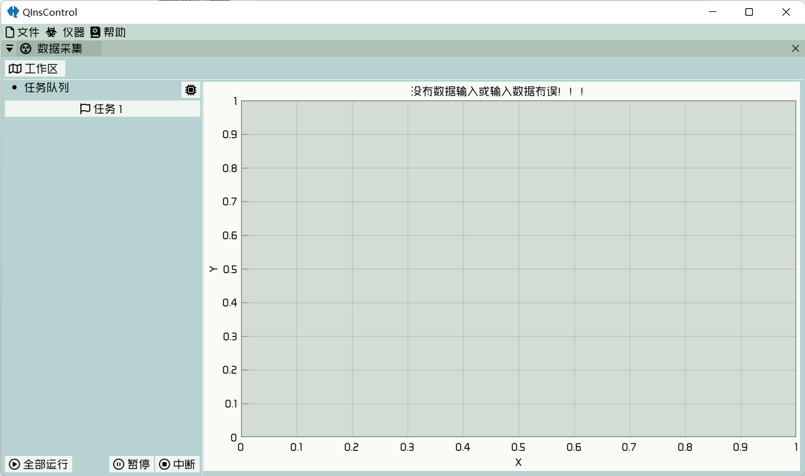

# Add Instruments

## auto-detect
One can click on "自动查询" to auto-detect the available instruments in NI MAX. 



## muanully add
Or manually add an instrument through clicking on "手动输入" after filling the address and clicking on "添加" in
the end. 



# Control the Instruments

Once adding instruments finishes, one can click "仪器设置和状态" to query the state of specific instrument or set it.
The controllable variables are classified by three types: sweep, set, read. 

## sweep
For the sweepable variables, it can be swept from the present value to the given value with difinite step size and delay.


## set
For the settable variables, it can be set by the given value through inputing or simply clicking on a pre-defined optional 
value.


## read
For the readable variables, it can be only queried.


All these variables support selecting unit and whether it will auto update the state itself.

# Data Aquiring

Clicking on "仪器 -> 数据采集" to do data aquiring



"工作区" : select root folder for saving data. Data will be stored as
```
root folder/year/month/day/[time] task name.qdt
```
"任务 1" : represent a task script to aquire data. One can click it to edit the script or right click for more options.

microchip : click it to edit circuit for recording measurement configuration.

"全部运行" : run all the available tasks in a top-down order

"暂停" : suspend the running task

"中断" : stop the running task

## edit script

### CodeBlock


It can be input with any julia codes. It is helpful when dealing with complicated relation between variables and it
supports all the grammar of julia language.

### StrideCodeBlock


It is similar to CodeBlock, but it can only be input a block title codes such as *for end*, *begin end*, *function end* and
so on. It is used to combine block codes in julia with other blocks in QInsControl.

### SweepBlock


It is used to sweep a sweepable quantity. One can click to select the specific instrument, address and quantity and input step, destination and delay. A sweepable quantity is generally dimensioned and one have to make sure that a 
correct unit is selected.

### SettingBlock


Similar to SweepBlock but for a settable quantity (a sweepable quantity is also a settable quantity). One can input a
string or a number dependent on the unit. When unit type is none, it only supports a string input and a "$" symbol is
able to be used to interpolate like in julia.

### ReadingBlock


"索引" is used to split the data by ",". When data do not include delimiter, leave it blank. "标注" is used to name the 
recorded data. When data format includes delimiter, one can use "," to seperate multiple marks.

### LogBlock


When it is executed, all the available instruments will be logged. (before and after script runing, a logging action 
will happen, so it is not necessary to add this block in the first and last line of a script)

### WriteBlock


Input the command and write to the specified instrument.

### QueryBlock


Input the command and query the specified instrument.

### ReadBlock


Read the specified instrument.

### SaveBlock


It is used to save a variable defined in the context. "标注" is an optional input to specify the name to be stored. When
it is blank, the name will be the same as the variable.

## Note
All the blocks that bind to a specified instrument can be middle clicked to enter catch mode. In this mode, the icon is 
red and the data obtained will be a "" when an error occurs. For ReadingBlock, QueryBlock and ReadBlock, middle clicking
at the region used to input marks will change the mode from normal to observable to observable and readable. In 
observable mode, the mark region is cyan and the obtained data will be stored in a variable named by the input marks
and will not be stored in file. In observable and readable region, the mark region is red, all same as observable mode
but the obtained data will stored in file. For ReadingBlock, WriteBlock, QueryBlock and ReadBlock, clicking on the block
border will enter the async mode. In this mode, block border is green and the generated codes will be marked by @async,
this almost always speeds up the measurement.

## Example


This panel includes a title of the editing task, a "HOLD" checkbox to set the panel no-close when selected, an inputable
region to record something necessary, a button "刷新仪器列表" with the same functionality as previous menu, an "Edit" or 
"View" checkbox to change the editing mode and finally a region to write your own script.

This script includes two loop structures. The outter one is constructed by a StrideCodeBlock with code
```julia
@progress for i in 1:2
```
on it. The macro @progress is used to show a progressbar. The inner one is constructed by a SweepBlock. It relates to
the instrument VirtualInstr with address VirtualAddress, variable "扫描测试", step 1 μA, destination 200 μA and delay 
0.1s for each loop.

## plot data


One can right click at the blank region to select plots to show.


The data used to plot includes four dimensions X Y Z W. X Y Z is regular dimensions and W is used to be calculated with others. To plot a heatmap, a matrix is necessay but the stored data format is as a vector so that it has to be specified
the dimensions of the Z plotting matrix and reverse it in dimension 1 or 2. At the bottom region, one can do some simple
data processing, and the selected data have bind to variables x, ys, z, ws. For Y and W dimension, they relate to
variables ys and ws respectively and can be accessed by index. For convenience, ys[1] and ws[1] is simply y and w.

One can middle click or right click at the plot region to find more options.

# Data Reviewing

Click on "文件 -> "打开文件"("打开文件夹") to open saved files. Here One can review the content stored in the file
includes the states of instruments, the script, the circuit, the data and the plots. Right click on the tabbar "绘图"
can modify the plots.